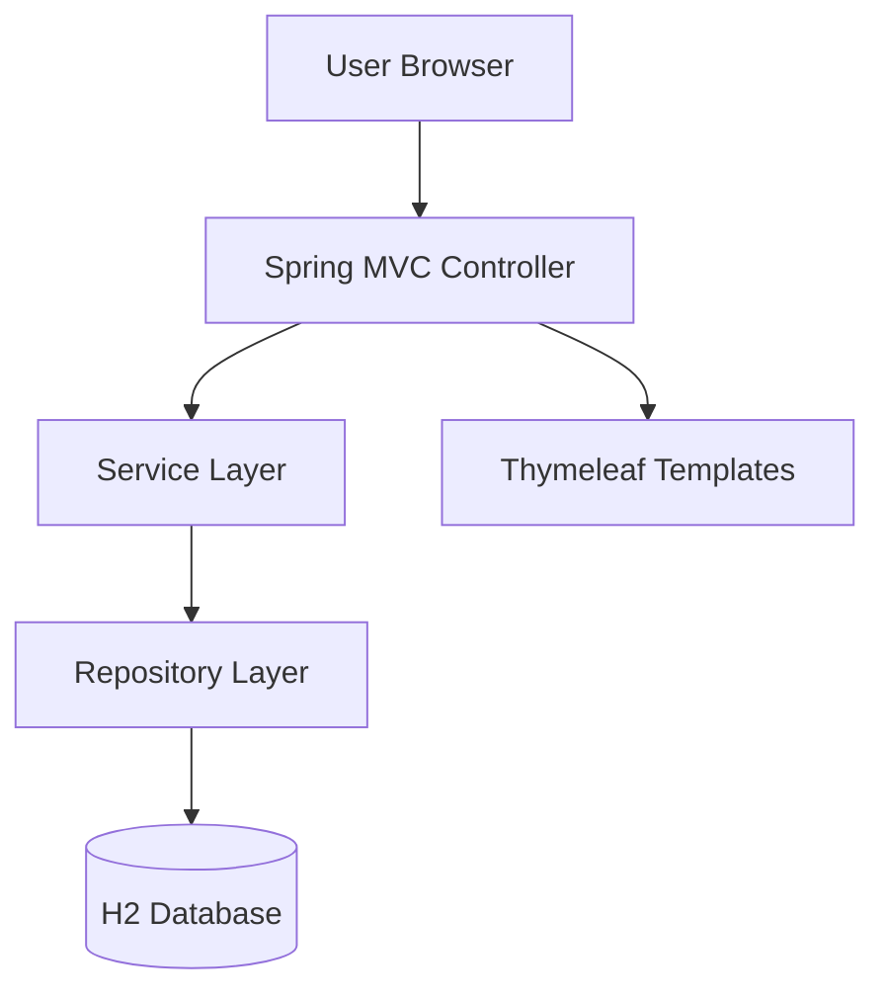
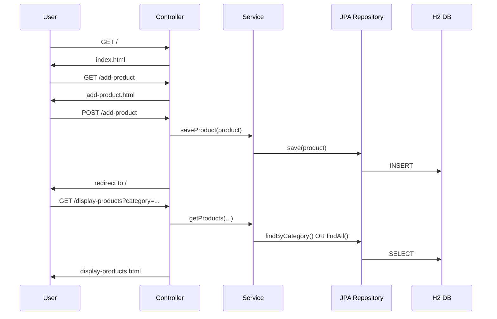

# 🚀 Spring IOC, Beans & JPA — Product Catalog System


A complete, production‑style demonstration of **Spring IOC**, **Beans**, **Dependency Injection**, **Spring MVC**, **Spring Data JPA**, and **Thymeleaf**, wrapped into a functional **Product Catalog Web Application**.

This project showcases real‑world Spring Framework fundamentals with a clean architecture and fully working CRUD features.

---

# 📌 Table of Contents
- [Overview](#overview)
- [Features](#features)
- [System Architecture](#system-architecture)
- [Flow Diagram](#flow-diagram)
- [Tech Stack](#tech-stack)
- [Project Structure](#project-structure)
- [Endpoints & Views](#endpoints--views)
- [Entity Model](#entity-model)
- [How to Run](#how-to-run)
- [H2 Database Access](#h2-database-access)
- [Troubleshooting](#troubleshooting)
- [License](#license)

---

# 📖 Overview
This **Spring Boot + IOC + Beans** powered application provides a simple yet powerful **Product Catalog** with full CRUD behavior through:

- Thymeleaf‑based UI  
- Spring MVC controllers  
- JPA repositories  
- H2 in-memory DB  
- IOC + DI-managed services  

It is ideal for learning or demonstrating **Spring Core concepts**.

---

# 🌟 Features

### ✔ Dependency Injection & IoC  
Services and controllers are wired automatically using Spring Beans.

### ✔ Add Products  
Fill out a form and store product data in H2 DB via JPA.

### ✔ Display Products  
See all products in a table with sorting and clean UI.

### ✔ Filter by Category  
Uses repository-level custom query.

### ✔ Thymeleaf UI  
Server-side rendered dynamic HTML pages.

### ✔ In-Memory H2 Database  
Zero configuration, auto‑created schema.

---

# 🏛 System Architecture



---

# 🔄 Flow Diagram (Page → Controller → Service → DB)



---

# 🧰 Tech Stack

| Component | Technology |
|----------|------------|
| Language | Java 17 |
| Framework | Spring Boot, Spring Core |
| DI / IoC | Spring Beans |
| Persistence | Spring Data JPA (Hibernate) |
| Database | H2 In‑Memory |
| Template Engine | Thymeleaf |
| Build Tool | Maven |

---

# 📂 Project Structure

```
src/
 ├── main/
 │   ├── java/com/SpringIOC/demo/
 │   │     ├── controller/
 │   │     │    └── ProductController.java
 │   │     ├── service/
 │   │     │    └── ProductService.java
 │   │     ├── repository/
 │   │     │    └── ProductRepository.java
 │   │     ├── entity/
 │   │     │    └── Product.java
 │   │     └── SpringIoc1Application.java
 │   │
 │   └── resources/
 │         ├── templates/
 │         │     ├── index.html
 │         │     ├── add-product.html
 │         │     └── display-products.html
 │         ├── application.properties
 │         └── static/
 │
 └── test/
       └── SpringIoc1ApplicationTests.java
```

---

# 🔗 Endpoints & Views

| URL | Method | Description | View |
|-----|--------|-------------|-------|
| `/` | GET | Homepage | index.html |
| `/add-product` | GET | Show product form | add-product.html |
| `/add-product` | POST | Save new product | redirect:/ |
| `/display-products` | GET | Display all or filtered by category | display-products.html |

---

# 🗄 Entity Model

### **Product.java**
```
id       (Long, Auto-generated)
name     (String)
price    (Double)
category (String)
```

---

# ▶️ How to Run

### **1. Clone the Repo**
```bash
git clone <REPO_URL>
cd SpringIOC
```

### **2. Build the Project**
```bash
mvn clean install
```

### **3. Run**
```bash
mvn spring-boot:run
```

### **4. Access in Browser**
```
http://localhost:8080/
```

---

# 🗃 H2 Database Access

Visit:
```
http://localhost:8080/h2-console
```

Use:

| Key | Value |
|-----|-------|
| JDBC URL | jdbc:h2:mem:productdb |
| Username | sa |
| Password | *(empty)* |

---

# 🛠 Troubleshooting

### ⚠ Whitelabel Error
Caused by template naming mismatch.  
Ensure:
```
add-product.html == return "add-product"
display-products.html == return "display-products"
```

### ⚠ H2 Shutdown Error
Fixed by:
```
spring.datasource.url=jdbc:h2:mem:productdb;DB_CLOSE_ON_EXIT=FALSE
```

---

# 📄 License
MIT License.

---

✨ *This README is crafted to be professional, recruiter‑friendly, and portfolio‑ready — showcasing your Spring IOC, DI, MVC, JPA, and Thymeleaf skills in the best possible way.*  
